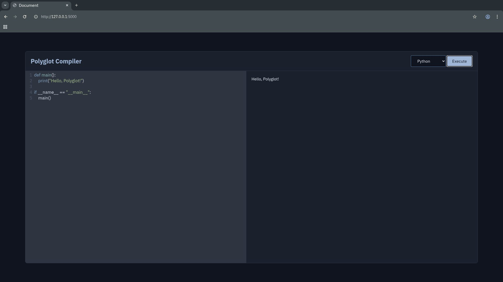

# Polyglot Engine

A secure, containerized remote code execution (RCE) environment. It allows users to write and execute code in an isolated sandbox via a clean, minimalist web interface.



## Features

- **Isolated Execution:** Runs untrusted user code in ephemeral Docker containers.
- **Resource Limits:** Prevents infinite loops and DoS attacks with strict limits (256MB RAM, 0.5 CPU, 5-second timeout).
- **Multiple Languages:** Currently supports Python (3.11) and Node.js (18).
- **Integrated IDE:** Vanilla HTML/CSS/JS frontend powered by CodeMirror.
- **DevOps CLI:** A built-in Bash management script for effortless building, testing, and teardown.

## Prerequisites

Before starting, ensure your system has the following installed

- **Docker & Docker Compose** (The engine relies entirely on containerization)
- **Git**
- **jq** (Command-line JSON processor required by the CLI)

⚠️ **Important:** Ensure **Port 5000** is free on your machine before starting the application.

## Quick Start

1. Clone the repository and navigate into the directory:
   ```bash
   git clone https://github.com/Staggered95/PolyglotCompiler.git
   cd PolyglotCompiler
   ```

2. Make the management script executable:
```bash
chmod +x ./scripts/manage.sh

```


3. Run the automated master command. This will check dependencies, pull base images, build the containers, start the API, automatically open the UI in your browser, and tail the server logs:
```bash
./scripts/manage.sh auto

```


## CLI Reference (`manage.sh`)

The `manage.sh` script is the control center for the engine.

| Command | Description |
| --- | --- |
| `auto` | Runs setup, builds images, starts the UI, and attaches live logs. (Recommended) |
| `setup` | Checks for dependencies (`jq`, `docker`, `git`) and pulls required base Docker images. |
| `build` | Builds and tags the Express API and Sandbox Docker images. |
| `start` | Boots the engine and opens the UI in your default browser. |
| `test` | A UI-less, terminal-based way to write and execute code via your `$EDITOR`. |
| `restart` | Rebuilds the API image and restarts the containers. |
| `logs` | Tails the Docker logs with colorized `[ERROR]` and `[SUCCESS]` tags. |
| `clean` | Destroys all containers, custom images, and empties the `workspaces/` directory. |

## Architecture Map

* **`views/`**: Contains the vanilla frontend (HTML, CSS, JS). Served statically by the Express backend.
* **`src/runner.ts`**: The Express API that receives code, writes it to a temporary file, and orchestrates the Docker spawn process.
* **`containers/`**: Dockerfiles for the API server and the language-specific Alpine sandboxes.
* **`workspaces/`**: A shared Docker volume where temporary user scripts are written right before execution.

